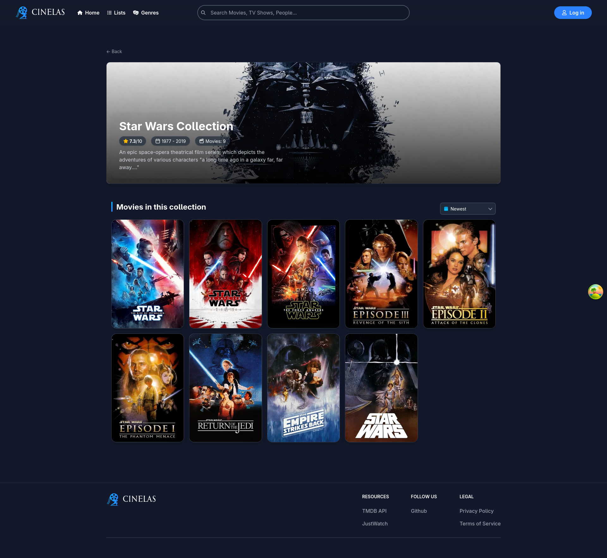
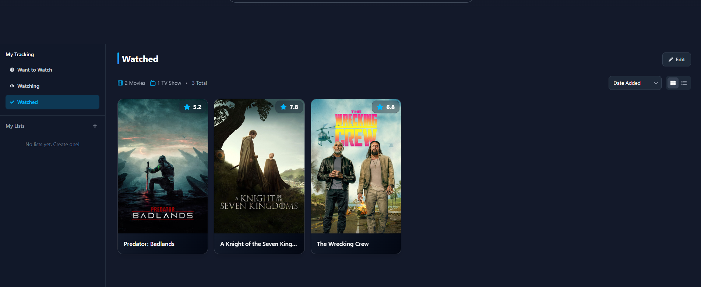
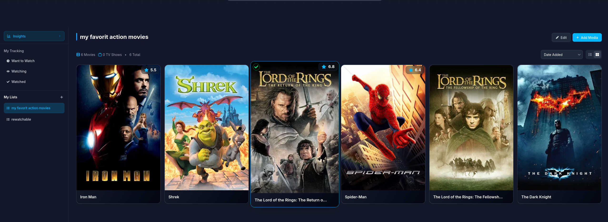
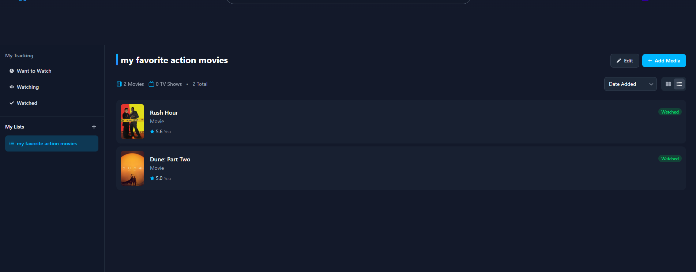
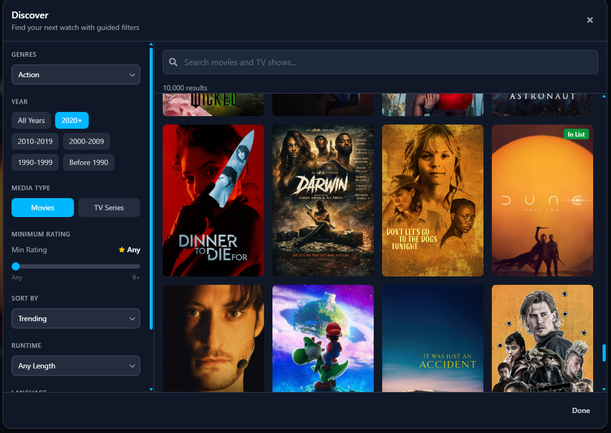
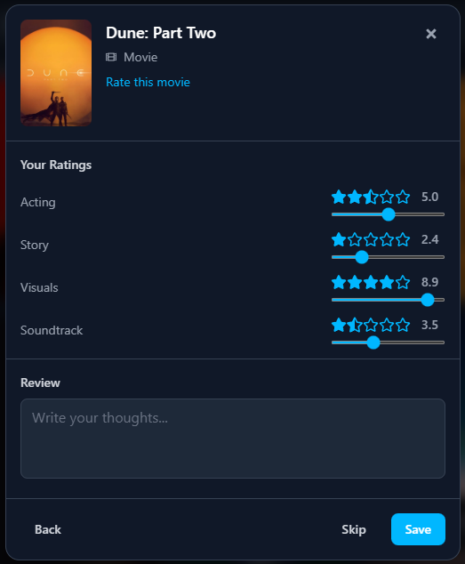

# MovieBucket

A full-stack movie and TV show discovery app built with React and .NET.


## Tech Stack

### Frontend


### Backend


## Features

-  **Search** - Movies, TV shows, and people with real-time results
-  **Browse by Genre** - Filter content with infinite scroll pagination
-  **Detailed Info** - Cast, crew, trailers, and watch providers
-  **Custom Lists** - Create and manage personal movie/TV collections with grid and list views
-  **Watch Tracking** - Track your watchlist status (Want to Watch, Watching, Watched)
-  **Reviews & Ratings** - Rate media across categories (Acting, Story, Visuals, Soundtrack)
-  **Discover Modal** - Find new content with advanced filters to add to your lists
-  **Google OAuth** - Secure authentication with cookie sessions
-  **Responsive** - Works on desktop and mobile

## Technical Highlights

- **20+ Custom React Hooks** for data fetching, sorting, and UI state
- **Backend Caching Layer** with 6-hour TTL for optimal performance
- **Bayesian Rating Algorithm** (IMDb-style) for fair popularity rankings
- **Full TypeScript Coverage** across the frontend

## Screenshots

| Homepage Grid | Homepage Carousels |
|:--------:|:------------------:|
|  |  |

| Movie Details | TV Show Details |
|:-------------:|:---------------:|
|  |  |

| Search | Login |
|:------:|:-----:|
|  |  |

| Browse by Genre | Genre Modal |
|:---------------:|:-----------:|
|  |  |

| Cast & Crew | Person Details |
|:-----------:|:--------------:|
|  |  |

| Collections |
|:-----------:|
|  |

### My Lists & Tracking

| My Tracking | Custom List (Grid View) |
|:-----------:|:-----------------------:|
|  |  |

| Custom List (List View) | Discover Modal |
|:-----------------------:|:--------------:|
|  |  |

| Review & Ratings |
|:----------------:|
|  |

## Architecture

```
React → React Query → Axios → .NET API → TmdbService (cached) → TMDB API
                                  ↓
                            PostgreSQL
```

## Quick Start

**Prerequisites:** Node.js, .NET 8 SDK, Docker, [TMDB API Key](https://www.themoviedb.org/signup)

```bash
# Clone the repo
git clone https://github.com/your-username/streaming-app.git
cd streaming-app

# Start the database
docker-compose up -d

# Backend (in /backend)
dotnet user-secrets set "Tmdb:ApiKey" "YOUR_KEY"
dotnet run

# Frontend (in /frontend)
echo "VITE_API_URL=https://localhost:7123" > .env.local
npm install && npm run dev
```

**Backend:** https://localhost:7123 (Swagger docs at `/swagger`)
**Frontend:** http://localhost:3000
