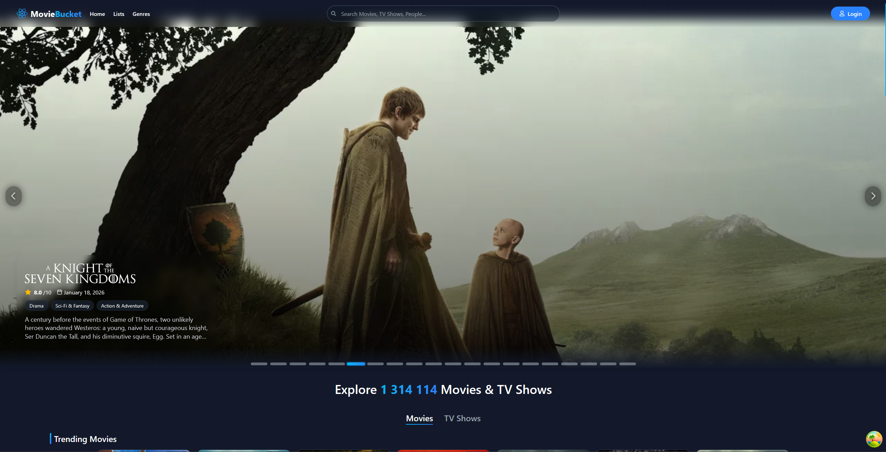
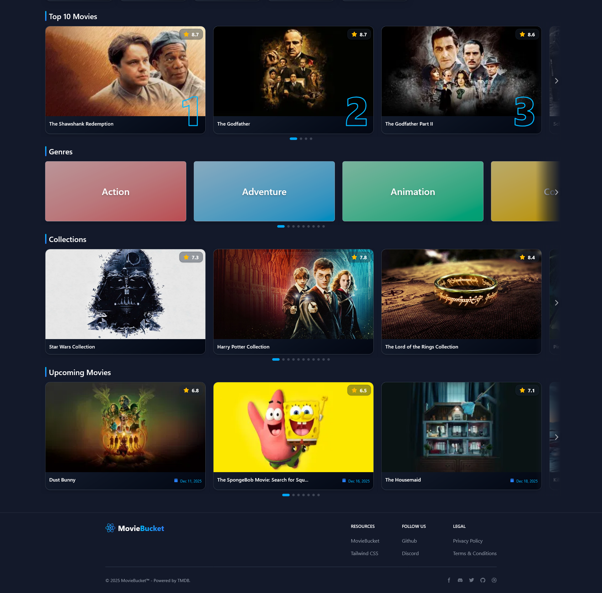
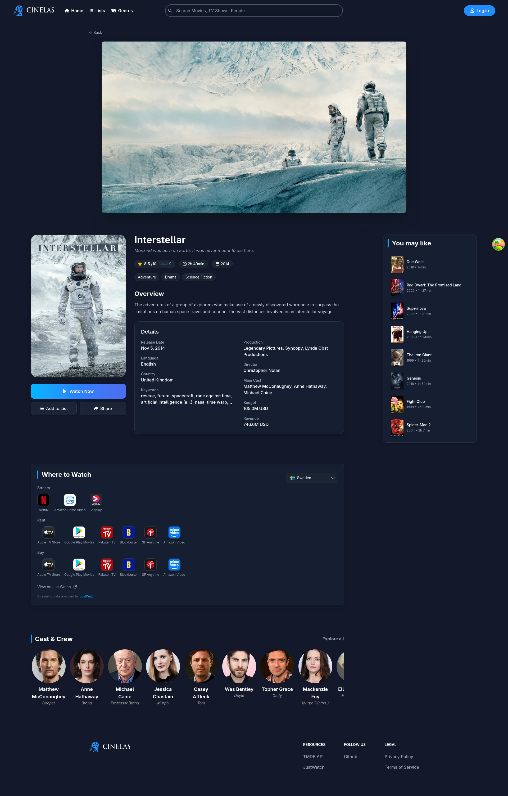
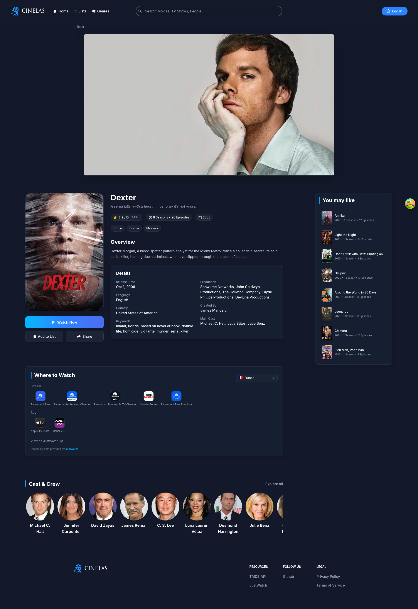
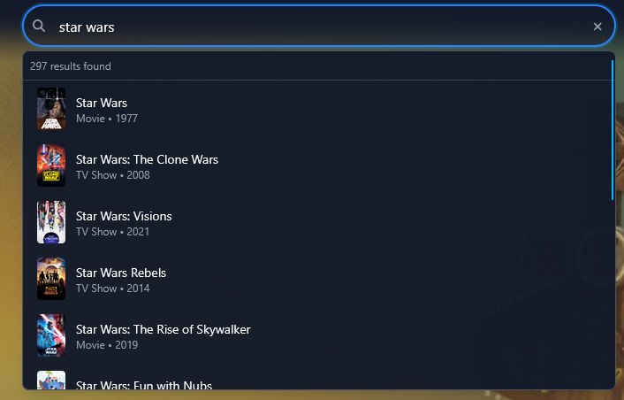
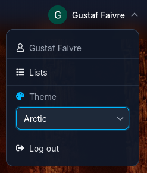
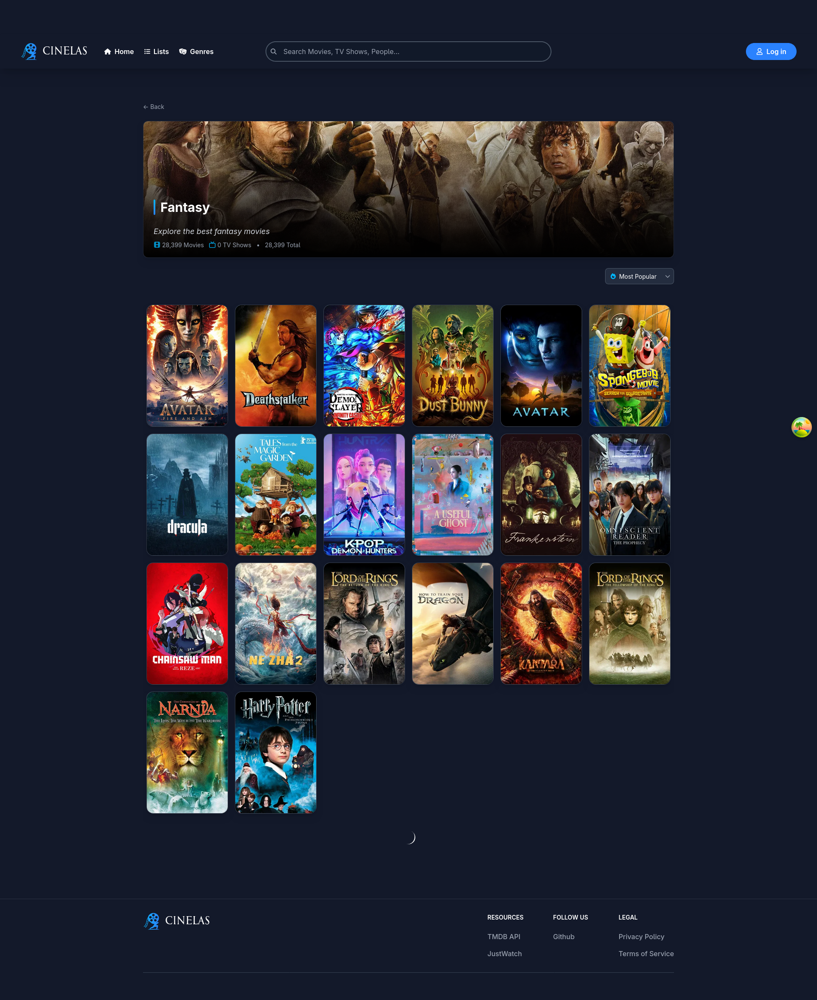
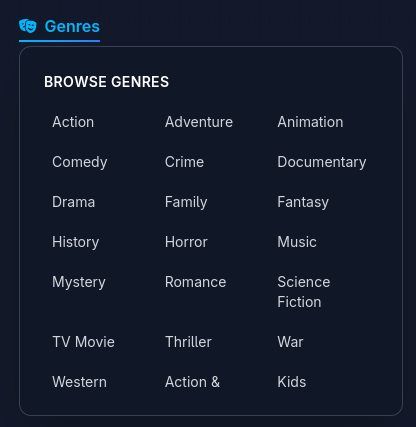
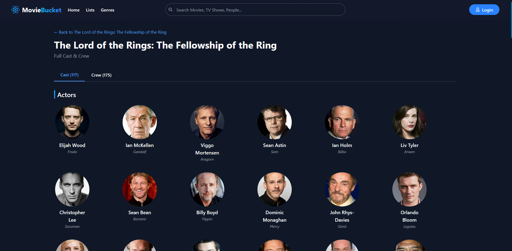
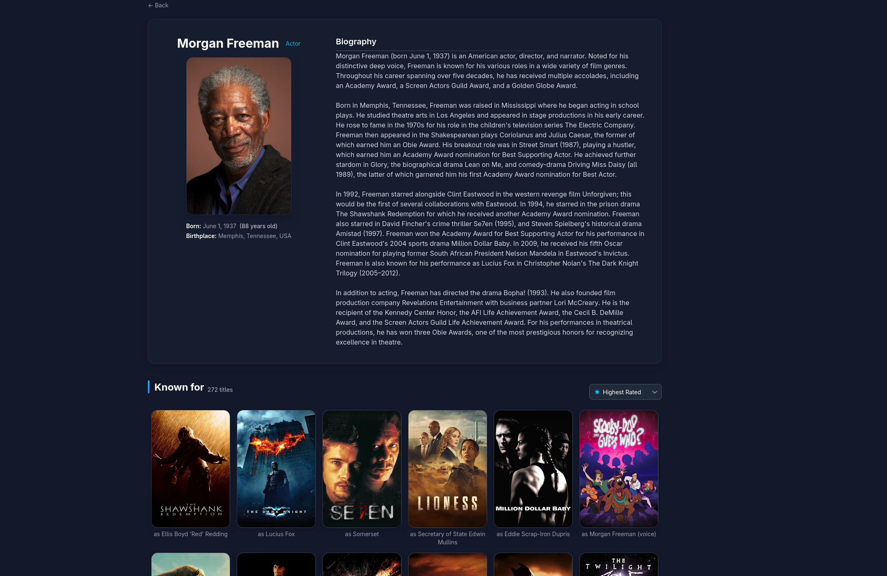

# MovieBucket

A full-stack movie and TV show discovery application demonstrating modern web development practices with React and .NET.



## About

MovieBucket is a personal project that showcases fullstack engineering capabilities through a polished media discovery experience. The application proxies data from The Movie Database (TMDB) API through a custom .NET backend, implementing caching strategies, secure authentication, and a responsive React frontend.

## Tech Stack

| Frontend | Backend | Infrastructure |
|----------|---------|----------------|
| React 18, TypeScript | .NET 8, C# | PostgreSQL 16 |
| Vite, Tailwind CSS | Entity Framework Core | Docker |
| React Query, Axios | ASP.NET Identity | OAuth 2.0 (Google) |

## Key Features

**Discovery**
- Trending, popular, top-rated, and upcoming content feeds
- Genre-based filtering with infinite scroll pagination
- Multi-type search across movies, TV shows, and people

**Media Details**
- Comprehensive detail pages with trailers, cast, and crew information
- Watch provider availability by region
- Related recommendations and collection browsing

**User Features**
- Google OAuth authentication with secure cookie sessions
- Personal watchlist management (coming soon)
- Share functionality for social media

## Technical Highlights

- **Custom Hooks Architecture**: 20+ reusable hooks encapsulating data fetching, sorting logic, and UI state management
- **Bayesian Rating Algorithm**: IMDb-style weighted rating calculation to handle vote count bias in popularity rankings
- **API Caching Layer**: Backend memory cache with 6-hour TTL combined with React Query client-side caching for optimal performance
- **Performance Optimizations**: Debounced hover interactions (200ms), lazy image loading, and infinite scroll pagination
- **Type Safety**: Full TypeScript coverage across the frontend codebase

## Screenshots

| Homepage | Homepage Carousels |
|:--------:|:------------------:|
|  |  |

| Movie Details | TV Show Details |
|:-------------:|:---------------:|
|  |  |

| Search | Login |
|:------:|:-----:|
|  |  |

| Genre Page | Genre Modal |
|:----------:|:-----------:|
|  |  |

| Cast and Crew | Person Filmography |
|:-------------:|:------------------:|
|  |  |

## Architecture Overview

The application follows a layered architecture with clear separation of concerns:

```
Frontend (React) → React Query → Axios → Backend API → TmdbService (cached) → TMDB API
```

- **Frontend**: React components manage UI state, React Query handles server state synchronization
- **Backend**: ASP.NET Core controllers route requests to services, TmdbService manages TMDB API communication with memory caching
- **Database**: PostgreSQL stores user data and authentication state via Entity Framework Core

## Getting Started

### Prerequisites

- Node.js (LTS version)
- .NET 8 SDK
- Docker Desktop
- TMDB API Key ([register here](https://www.themoviedb.org/signup))

### Backend Setup

```bash
# Clone and navigate to backend
git clone https://github.com/your-username/streaming-app.git
cd streaming-app/backend

# Configure TMDB API key
dotnet user-secrets init
dotnet user-secrets set "Tmdb:ApiKey" "YOUR_TMDB_API_KEY"

# Start PostgreSQL
cd .. && docker-compose up -d && cd backend

# Run the server
dotnet restore && dotnet run
```

The API will be available at `https://localhost:7123`.

### Frontend Setup

```bash
cd frontend
npm install

# Create environment file
echo "VITE_API_URL=https://localhost:7123" > .env.local

npm run dev
```

The application will be available at `http://localhost:3000`.

## API Documentation

Interactive API documentation is available via Swagger UI at `https://localhost:7123/swagger` when running the backend in development mode.

## License

This project is licensed under the MIT License. See the LICENSE.md file for details.
