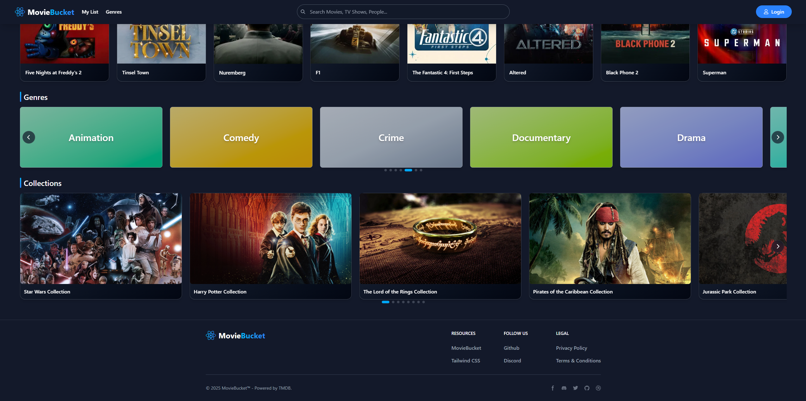
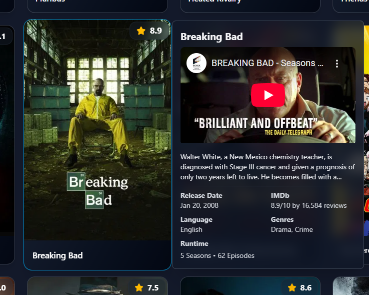
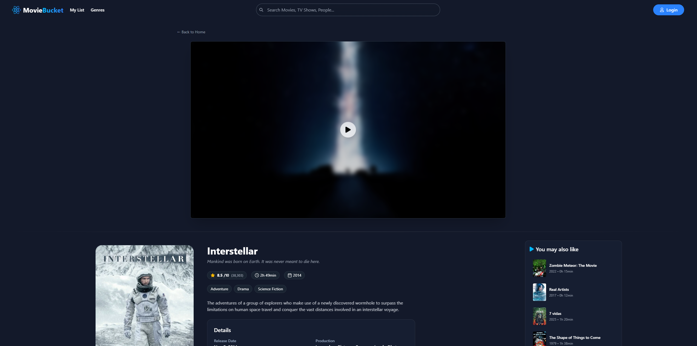
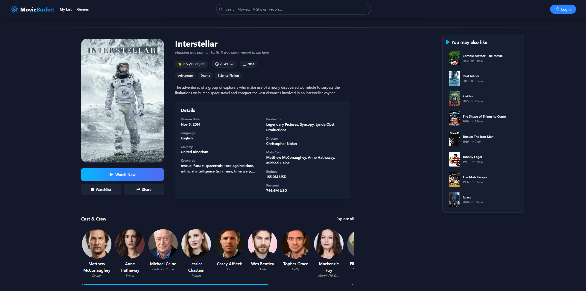
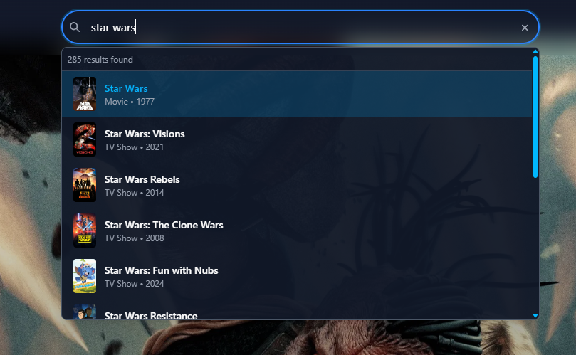
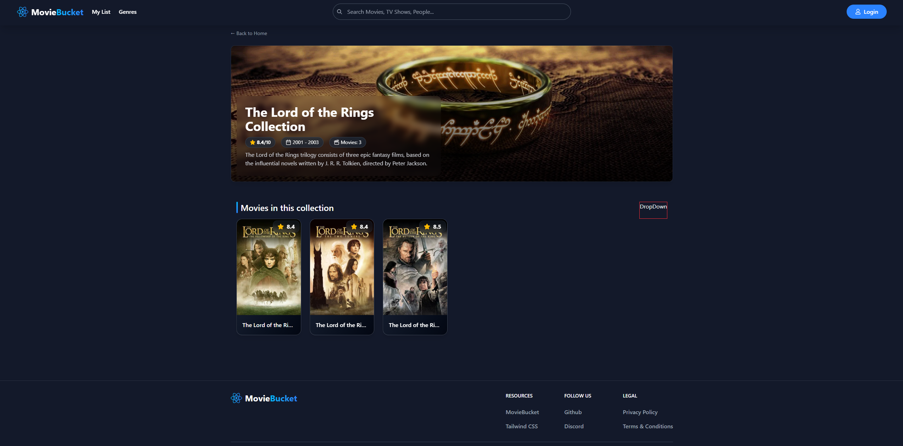
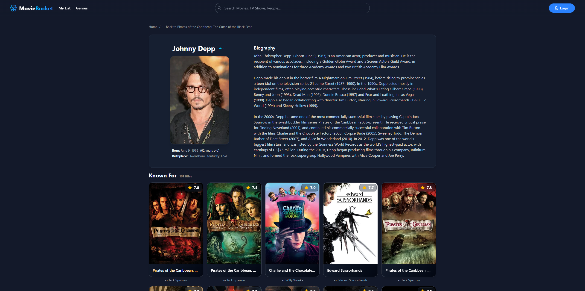
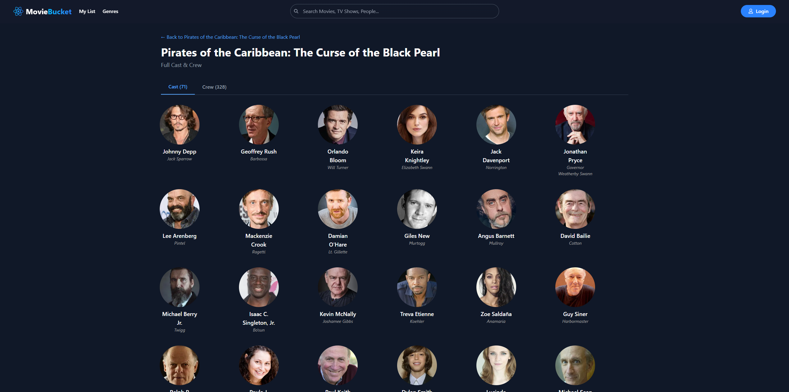

# MovieBucket

MovieBucket is a modern, full-stack web application designed to help you discover, track, and explore movies and TV shows. This project is built with a focus on clean architecture, a responsive user experience, and best-in-class development practices.


## Features

- **Discover Media:** Browse extensive lists of movies and TV shows.
- **Trending Content:** Stay up-to-date with what's currently trending.
- **Detailed Information:** Get in-depth details for any movie or TV show, including cast, crew, genres, and similar titles.
- **Powerful Search:** Quickly find media by title.
- **Genre-based Exploration:** Discover content by browsing through genres.
- **User Watchlists:** (Coming Soon) Track media you want to watch.
- **Secure Authentication:** User accounts with secure OAuth 2.0 integration.

## Screenshots

A sneak peek into the MovieBucket experience.

### Browse & Discover

|                            Genre Collections                            |                    Media Modal                    |
| :---------------------------------------------------------------------: | :-----------------------------------------------: |
|  |  |

### Media Details

|                     Details View 1                      |                     Details View 2                      |
| :-----------------------------------------------------: | :-----------------------------------------------------: |
|  |  |

### Search & Collections

|                 Search                  |                   Collection Detail                    |
| :-------------------------------------: | :----------------------------------------------------: |
|  |  |

### Cast & Crew

|                   Cast Details                    |                    Cast Explore                     |
| :-----------------------------------------------: | :-------------------------------------------------: |
|  |  |

## Tech Stack

This project is built with a modern, decoupled frontend and backend architecture.

**Frontend:**

- [React 18](https://react.dev/)
- [Vite](https://vitejs.dev/)
- [TypeScript](https://www.typescriptlang.org/)
- [Tailwind CSS](https://tailwindcss.com/)
- [React Query](https://tanstack.com/query/latest)
- [Axios](https://axios-http.com/)

**Backend:**

- [.NET 8](https://dotnet.microsoft.com/en-us/) (ASP.NET Core)
- [C#](https://learn.microsoft.com/en-us/dotnet/csharp/)
- [Entity Framework Core 8](https://learn.microsoft.com/en-us/ef/core/)
- [PostgreSQL](https://www.postgresql.org/)
- [Docker](https://www.docker.com/) for containerization

**APIs & Authentication:**

- [TMDB API](https://www.themoviedb.org/documentation/api) for all media content.
- [OAuth 2.0](https://oauth.net/2/) for secure user authentication (Google).

## Getting Started

Follow these instructions to get the project up and running on your local machine for development and testing purposes.

### Prerequisites

- [Node.js](https://nodejs.org/en) (LTS version)
- [.NET 8 SDK](https://dotnet.microsoft.com/en-us/download/dotnet/8.0)
- [Docker](https://www.docker.com/products/docker-desktop/) (for running PostgreSQL)
- A TMDB API Key - [Get one here](https://www.themoviedb.org/signup)

### Backend Setup

1.  **Clone the repository:**

    ```bash
    git clone https://github.com/your-username/streaming-app.git
    cd streaming-app/backend
    ```

2.  **Configure User Secrets:**
    Set up your TMDB API Key using the .NET Secret Manager. This keeps your key out of the codebase.

    ```bash
    dotnet user-secrets init
    dotnet user-secrets set "Tmdb:ApiKey" "YOUR_TMDB_API_KEY"
    ```

3.  **Launch PostgreSQL using Docker:**
    Navigate to the root of the project and run:

    ```bash
    # (Assuming a docker-compose.yml is present in the root)
    docker-compose up -d
    ```

    _If no `docker-compose.yml` is available, you will need to run a PostgreSQL container manually._

4.  **Run the backend server:**
    ```bash
    dotnet restore
    dotnet run
    ```
    The API will be available at `http://localhost:5000` (or as specified in `launchSettings.json`). The Swagger UI can be found at `http://localhost:5000/swagger`.

### Frontend Setup

1.  **Navigate to the frontend directory:**

    ```bash
    cd ../frontend
    ```

2.  **Install dependencies:**

    ```bash
    npm install
    ```

3.  **Create an environment file:**
    Create a `.env.local` file in the `frontend` directory and add the URL for the backend API:

    ```
    VITE_API_BASE_URL=http://localhost:5000
    ```

4.  **Run the development server:**
    ```bash
    npm run dev
    ```
    The application will be available at `http://localhost:3000`.

## 📝 License

This project is licensed under the MIT License - see the `LICENSE.md` file for details.
