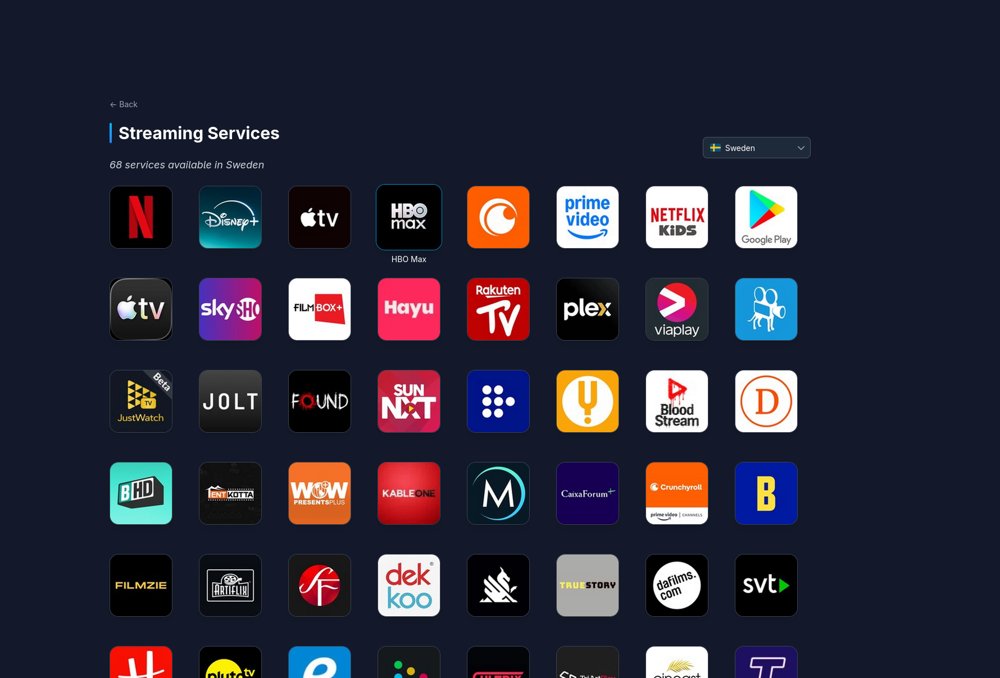
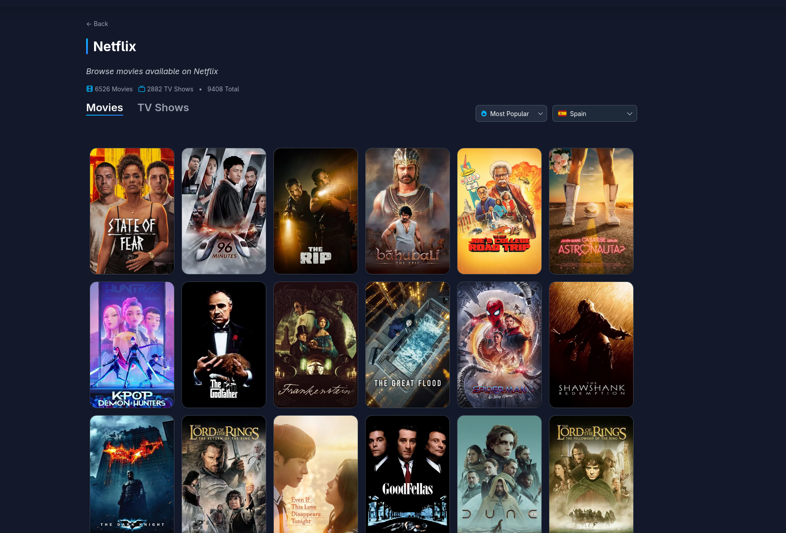
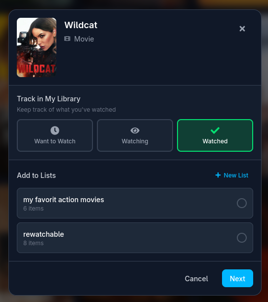

# Cinelas

**Your personal cinema atlas.** Explore, track, and collect over 1.3 Million movies and TV shows.


## Tech Stack

### Frontend


### Backend


## Features

- **Search** — Instant results across movies, TV shows, and people as you type
- **Browse by Genre** — Deep-dive into any genre with infinite scroll and smart filtering
- **Rich Media Pages** — Full cast & crew, trailers, ratings, and exactly where to stream it
- **Streaming Services** — Browse by hundreds of providers by country and explore their full catalogs
- **Custom Lists** — Build and curate personal collections with grid and list views
- **One-Click Tracking** — Mark anything as Want to Watch, Watching, or Watched from anywhere in the app
- **Reviews & Ratings** — Score media across four dimensions: Acting, Story, Visuals, and Soundtrack
- **Discover Modal** — Surface hidden gems with advanced filters and add them straight to your lists
- **Google OAuth** — Frictionless sign-in with secure cookie sessions
- **Responsive** — Feels native on desktop and mobile

## Coming Soon

- **Insight dashboard for lists**
- **AI-powered suggestions**
- **Email reminder for upcoming releases**
- **Shareable lists**

## Technical Highlights

- **20+ Custom React Hooks** for data fetching, sorting, and UI state
- **Backend Caching Layer** with 6-hour TTL for optimal performance
- **Bayesian Rating Algorithm** (IMDb-style) for fair popularity rankings
- **Full TypeScript Coverage** across the frontend

## Screenshots

| Homepage(1/2) | Carousels(2/2) |
|:--------:|:---------:|
|  |  |

| Movie Details | TV Show Details |
|:-------------:|:---------------:|
|  |  |

| Search | Browse by Genre |
|:------:|:---------------:|
|  |  |

| Genre Filter Modal | Cast & Crew |
|:------------------:|:-----------:|
|  |  |

| Person Details | Collections |
|:--------------:|:-----------:|
|  |  |

### Streaming Services

| All Providers | Provider Catalog |
|:-------------:|:----------------:|
|  |  |

### My Lists & Tracking

| My Tracking | Custom List (Grid View) |
|:-----------:|:-----------------------:|
|  |  |

| Custom List (List View) | Track & Add to List |
|:-----------------------:|:-------------------:|
|  |  |

| Discover Modal | Review & Ratings |
|:--------------:|:----------------:|
|  |  |

## Architecture

```
React → React Query → Axios → .NET API → TmdbService (cached) → TMDB API
                                  ↓
                            PostgreSQL
```

## Quick Start

**Prerequisites:** Node.js, .NET 8 SDK, Docker, [TMDB API Key](https://www.themoviedb.org/signup)

```bash
# Clone the repo
git clone https://github.com/your-username/streaming-app.git
cd streaming-app

# Start the database
docker-compose up -d

# Backend (in /backend)
dotnet user-secrets set "Tmdb:ApiKey" "YOUR_KEY"
dotnet run

# Frontend (in /frontend)
echo "VITE_API_URL=https://localhost:7123" > .env.local
npm install && npm run dev
```

**Backend:** https://localhost:7123 (Swagger docs at `/swagger`)
**Frontend:** http://localhost:3000
